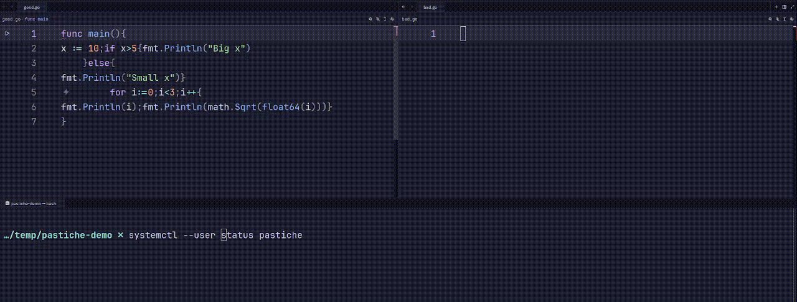

# Pastiche

A clipboard code formatting daemon with a lovely extendable `Formatter` interface. Copy source code from a PDF file or agentic coding tool, hit your hotkey (or just copy and wait), and `pastiche` formats it in place — gofmt, black, rustfmt, or anything you plug in.

<p>
    
</p>


## Motivation

I read a whole lotta programming books. Important information always goes into an Obsidian vault. Copying code from sources that do not preserve formatting has always been a hassle, though with code editors and IDEs nowadays providing automatic formatting and linting on save or hotkey press life became much easier. But the problem still exists, when there is no formatter available at hand's reach -- pressing tabs and spaces inside backticks gets painful really fast. This is why `pastiche` exists, to make sure that the code is formatted before it even hits the document. 

## Quick Start

Before running the daemon, install it. Make sure that your have a Go toolchain available on your system, otherwise please see [this page](https://golang.org/doc/install) first.

```sh
go get github.com/inflame-ue/pastiche@latest
```

You will then be able to configure the application and either run it in a blocking terminal window or install it as a user-level daemon:

```sh
# Configure the trigger, hotkey, etc
pastiche configure

# Run in a terminal window
pastiche

# Install as a user-level daemon
pastiche install
```

**Note:** If no config file exists, `pastiche daemon` and `pastiche status` will fail with an error. Therefore, make sure to always run `pastiche configure`, which will create a `pastiche.toml` configuration file in your `.config` directory.

## Usage

### Trigger modes

| Mode | Behavior |
|---|---|
| `autowatch` | Detects code in clipboard changes and formats automatically |
| `hotkey`   | Waits for a keypress (e.g. Ctrl+I) to read clipboard and format |
| `both`     | Autowatch in background + hotkey for manual formatting |

### Built-In Formatters

| Language | Tool | Status |
|---|---|---|
| Go | `go/format`  | Built-in, no external dep |
| Python | `black` | Requires `pip install black` |
| Rust | `rustfmt` | Requires `rustup component add rustfmt` |


### Commands

```
pastiche            Run the daemon (default)
pastiche configure  Open the TUI config editor
pastiche install    Install as a systemd user service
pastiche status     Show config and formatter availability
```

### Config

Written to `~/.config/pastiche/pastiche.toml`. The `configure` command edits it interactively.

```toml
[trigger]
mode = "autowatch"

[hotkey]
key = 9

[heuristic]
value = 3

[formatters]
order = ["go", "python", "rust"]
```


## Contributing

Adding a formatter for a new language is the most valuable contribution. See [CONTRIBUTING.MD](./CONTRIBUTING.md) for how to set up the project for development.

1. Create `internal/formatter/<name>/<name>.go`
2. Implement the `Formatter` interface:

```go
type Formatter interface {
		Name() string
		Format(src []byte) ([]byte, error)
}
```

`Name()` returns the language identifier used in config (e.g. `"json"`).
`Format()` takes raw source and returns formatted source.

3. Register it in `internal/formatter/format.go` — add the import and call `reg.Register(...)` in `NewFormatterRegistry()`.
4. Add it to the default formatter order in `internal/config/config.go` if appropriate.
5. Write a test. Look at `internal/formatter/gofmt/gofmt_test.go` for the pattern. Tests can optionally skip, if no formatter tool is available on the system.

All other pull requests are welcome as well. If you want to propose a new feature, please open an issue first.
